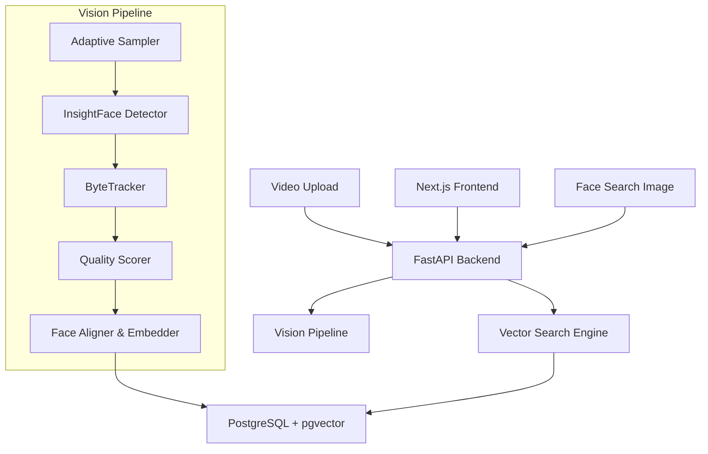

# FACET: Face Analysis, Correlation, and Extraction Tool

FACET is a high-performance, open-source face search system designed to process video content, track individual identities, and allow for lightning-fast face retrieval using vector similarity.

## 🚀 Overview

FACET combines state-of-the-art computer vision models with a modern Next.js frontend and a PostgreSQL/pgvector backend. It is designed to be robust, efficient, and easy to deploy via Docker.

### Core Features
- **Adaptive Video Sampling**: Intelligently skips frames during processing to maximize throughput while maintaining track integrity.
- **Robust Face Tracking**: Utilizes ByteTrack to maintain consistent identities across occlusions and motion blur.
- **Pose-Aware Quality Scoring**: Automatically selects the best "Identity" frames by analyzing face size, sharpness, and head pose (yaw/pitch).
- **Temporal Identity Averaging**: Generates a single, robust "Identity Vector" per track by averaging embeddings from the highest-quality samples.
- **Instant Search**: Leverages `pgvector` for sub-millisecond similarity searches against millions of face embeddings.
- **Premium UI**: A sleek, dark-themed Next.js interface with glassmorphism and smooth animations.

---

## 🏗️ Architecture

FACET is built with a modular, service-oriented architecture:



---

## 🛠️ Technology Stack

- **Frontend**: Next.js, Tailwind CSS, Framer Motion, Lucide React
- **Backend**: FastAPI (Python), SQLAlchemy, Uvicorn
- **Computer Vision**: InsightFace (ArcFace/Buffalo_L), ByteTrack, YOLOX, OpenCV
- **Database**: PostgreSQL with `pgvector`
- **Deployment**: Docker, Docker Compose

---

## 📖 Working Principles

### 1. The Vision Pipeline
When a video is uploaded, the backend initiates a streaming process. Unlike naive systems that process every frame, FACET uses an **Adaptive Sampler** that skips forward when no faces are present, dramatically reducing CPU load.

### 2. Identity Stabilization
Tracking faces in video is difficult. FACET uses **ByteTrack** to correlate detections across frames. For every track, the **Quality Scorer** analyzes landmarks to find the frames where the subject is looking directly at the camera with maximum clarity.

### 3. Face Alignment & Embedding
Before being converted to a vector, faces are "aligned." Using **InsightFace's norm_crop**, the eyes and mouth are moved to standard coordinates. This ensures that the generated embedding is invariant to slight tilts and rotations.

### 4. Vector Search
Search is powered by the **Cosine Distance** operator (`<=>`) in `pgvector`. Instead of matching images, FACET matches the mathematical "essence" of a face, allowing it to find the same person across different lighting conditions and ages.

---

## 🚦 Getting Started

### Prerequisites
- Docker and Docker Compose
- 8GB+ RAM (Recommended for ML models)

### Setup & Installation

1. **Clone the repository**:
   ```bash
   git clone https://github.com/your-username/facet.git
   cd facet
   ```

2. **Launch the stack**:
   ```bash
   sudo docker compose up --build
   ```

3. **Access the UI**:
   Open [http://localhost:3000](http://localhost:3000) in your browser.

---
